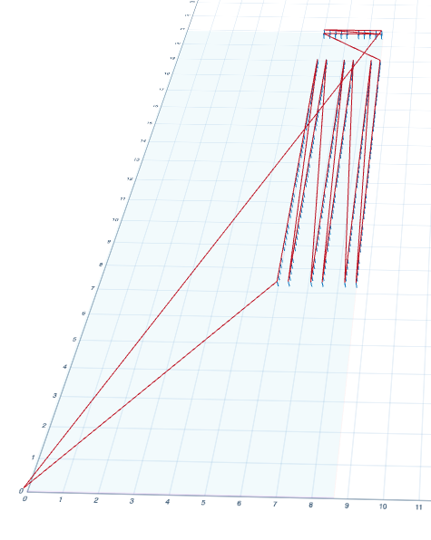

= Cribbage Board

This project outputs g-code to cut a cromulent cribbage board. Set flags for material depth, bit size, and safe travel height all in floating point inches. Note that if you change the bit size from 0.125 (⅛"), your pegs will need to be comically sized as compared to a standard board.

----
Usage of ./cribbageboard:
  -bitsize float
        diameter of end mill (default 0.125)
  -format string
        output format (svg,nc) (default "nc")
  -zdepth float
        material thickness (default 0.125)
  -ztravel float
        safe travel height (default 0.15)
----

== Example

== Is it good?

I think it works, but it could be optimized in various ways.